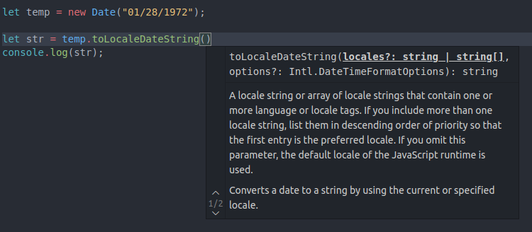
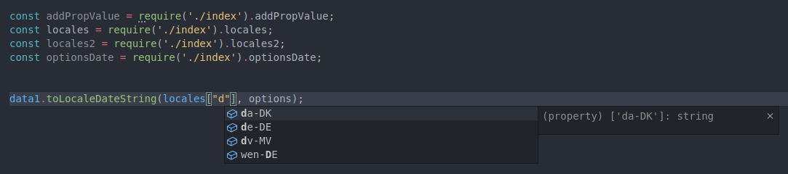

# DDate

Devido a falta tipagem estática do Javascript, a consulta dos parâmetros de funções de certos objetos, como o ```Date``` fica sujeita a pesquisa em documentação. O objetivo do ```DDate``` é prover um forma fácil e intuitiva de manipular os parâmetros opcionais das funçoes ```toLocaleDateString```, ```toLocaleString``` e ```toLocaleTimeString```.  Para configurar os parâmetros destas funções é necessário informar um string de localidade, ```locales``` e depois um objeto com as opções de configurações que é o ```options```, conforme print abaixo:



E quantidade de opções de configuração é grande! O objeto ```options``` necessita de pares de chave (o nome da propriedade que se desja alterar) e valor (uma string padronizada). Exemplo:

```javascript
let data1 = new Date("01/28/1972");

var options = { weekday: 'long', year: 'numeric', month: 'long', day: 'numeric' };
console.log(data1.toLocaleDateString('de-DE', options));
// ==> Freitag, 28. Januar 1972
```
Agora o mesmo exemplo usando o objeto ```locales``` de DDates:


